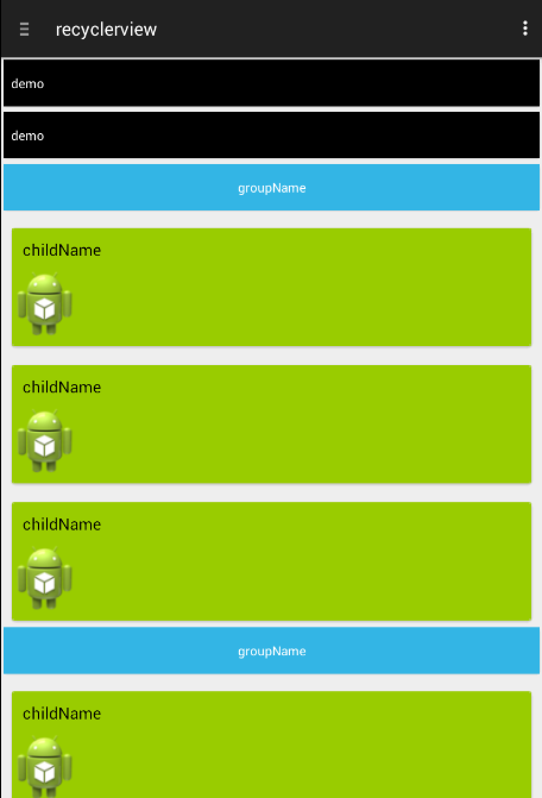

recyclerview
============

符合material design的recyclerview，为recyclerview添加了可加入headerview和footerview的方法，
添加方法：
addHeaderView(View mView)
addFooterView(View mView)

删除方法：
removeHeaderView()
removeFooterView()

并且每一个item都可以有点击事件，类似listview. setOnItemClickListener事件
因为添加了headerview以及footerview，position会根据headerview的个人进行偏移，暂时没有想到好的方法，我会继续更改的

